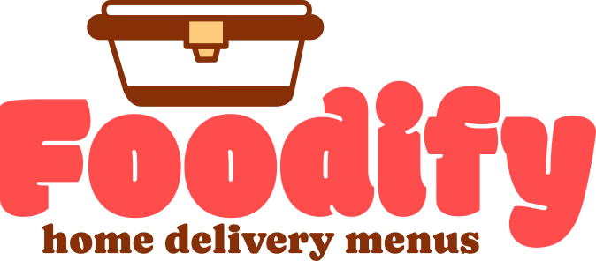
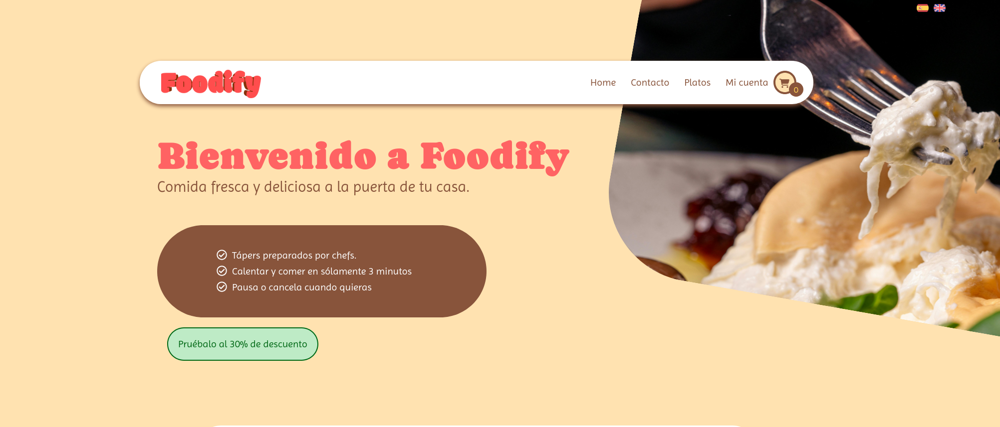

 
 
 
**Desarrollo del proyecto:**

Marta y Andrés crearon la empresa ****Foodify**** de servicio de comida preparada a domicilio en 2020. Empezando con una pequeña tienda en Etxebarri han ido creciendo y abriendo sucursales por todo el territorio. Han decidido dar el salto a la venta online de sus productos y para ello han contratado los servicios del grupo The Gitters que desarrollará una web de e-commerce que lleve su negocio a internet.

Como primer paso se celebró una reunión entre la Product Owner designada por The Gitters y Andrés como representante del cliente donde se definieron las necesidades del producto: número de páginas que contendría el sitio, elementos a presentar, obligatoriedad de dos idiomas dado el territorio de origen de la marca así como la posibilidad de un tercer idioma con vistas a futuro de ampliación del negocio a otros territorios.

La empresa **Foodify** aportará los colores, fotos de los platos e identidad corporativa de manera que la página web se integre en el ecosistema de la marca.

Se prepará un diseño preliminar en FIGMA que se presenta al cliente con todas las páginas que contendrá el sitio, sus diseños básicos, interrelaciones y funcionalidades esperadas. Tras su aprobación se comienza el desarrollo de código y se van presentando los avances al cliente de manera periódica para su aprobación.
 
 
**La estructura de la web cuenta con:**

Una página principal de acceso donde se presenta la empresa y sus productos.

Una página de catálogo donde aparecen todos los platos que **Foodify** prepara para su distribución y desde donde se pueden ir añadiendo al pedido.

El pedido se mostrará en un carrito para su revisión por parte del cliente.

Y un checkout

Al ser un sitio de ecommerce deberá contar con un registro y login de usuarios que los identifique y guarde sus datos para la compra y futuro. Así mismo presentará las disposiciones legales necesarias para este tipo de sitios.

Los clientes están orgullosos de su historia y equipo por lo que han solicitado la inclusión de una página que presente la empresa, sus fundadores y sus empleados.

 
 
 
 
 

 
 

Este proyecto es un ejercicio realizado en el Bootcamp Full-Stack de PeñascalF5.

**Los integrantes del grupo The Gitters son:**

| EQUIPO | FUNCIONES |
|-------------|-----------------------------------------------------------------|
|  | **Belén:** Product Owner del proyecto. Es la encargada de la relación con el cliente, transmitir sus necesidades al equipo y presentar los resultados para su validación.|
|  | **Paco:** Scrum Master. Es el responsable de que todo funcione correctamente,que el equipo trabaje de manera fluida y resolver aquellos problemas que puedan surgir durante el desarrollo. |
|  | **Gaizka:** Además de programador realiza las labores de diseño visual de la página web |
|  | **Igor**: Programador dentro del proyecto |
|  | **Youssef:** Programador dentro del proyecto |

 
 
 

**El proyecto tiene los siguientes parámetros:**
<ul>
<li>Se solicitó el desarrollo de una página web de comercio electrónico que utilizara todo lo aprendido hasta el momento dentro del Bootcamp.</li>

<li>Por la parte de programación debe contener código HTML, CSS, Javascript, documentos JSON y ser responsive para poder ser presentada en dispositivos móviles.</li>

<li>Al ser un proyecto en grupo se deberá utilizar GIT y GITHUB para el desarrollo común del código.</li>

<li>Por la parte de soft skills se deben implementar técnicas SCRUM y AGILE.</li>

<li>Se creará un tablero de TRELLO para el seguimiento de las tareas y una presentación en FIGMA para el diseño preliminar de la web.</li>
</ul>

 
 

**Los parámetros más importantes del proyecto son:**
<ul>
<li>La web será un portal para la venta electrónica de productos. En este caso se ha elegido la venta de comida precocinada.</li>

<li>Entre todas las páginas diseñadas habrá una con un catálogo de productos en venta con al menos 12 repartidos en 3 ó 4 categorías. Cada producto se visualizará de manera individual con una página detalle donde aparezcan todas sus características.</li>

<li>Con los productos seleccionados a su compra se generará una página de carrito seguida de una de checkout.</li>

<li>Como todos los sitios de compra online deberá contar con una sección de registro y login de clientes.</li>

<li>Se deja a criterio del grupo de desarrollo la elección de colores, tipografía y otros elementos de diseño e imagen de marca.</li>

<li>El sitio deberá ser multilingüe con al menos dos idiomas.</li>
</ul>
